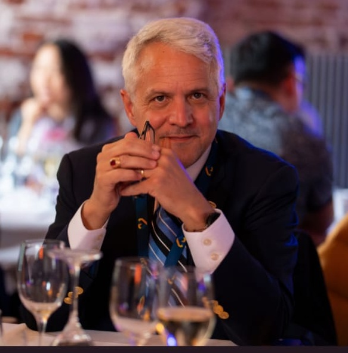

---
# Hero Section Module
# Top banner with profile photo and contact info
---

```{r}
#| label: hero-html
#| output: asis
#| eval: !expr is_html

cat('
<div class="hero-section">



## About {.unnumbered}

<div class="profile-summary">

Finance Professor and Academic Administrator with **25+ years** of proven leadership in building successful, revenue-generating programs. I specialize in transforming academic operations through strategic planning, innovative curriculum design, and stakeholder-focused management.

**Core Competencies:** Program Development & Growth • Strategic Planning • Budget Management • Enrollment Strategy • Faculty Development • Accreditation Leadership • Stakeholder Relations • Data-Driven Decision Making

</div>

### Quick Links {.unnumbered}

<div class="quick-links">

<a href="#administrative-leadership" class="nav-btn"><i class="fas fa-users-cog"></i> Leadership</a>
<a href="#education-credentials" class="nav-btn"><i class="fas fa-graduation-cap"></i> Education</a>
<a href="#research-impact" class="nav-btn"><i class="fas fa-microscope"></i> Research</a>
<a href="papers.html" class="nav-btn"><i class="fas fa-file-alt"></i> Working Papers</a>

</div>

### Contact {.unnumbered}

<div class="contact-grid">

- <i class="fas fa-envelope"></i> [john.broussard@rutgers.edu](mailto:john.broussard@rutgers.edu)
- <i class="fas fa-globe"></i> [Personal Website](https://tinyurl.com/c3wdneyp)
- <i class="fab fa-linkedin"></i> [LinkedIn Profile](https://tinyurl.com/5bfex8hv)
- <i class="fab fa-orcid"></i> [ORCID: 0000-0002-5090-9947](https://orcid.org/0000-0002-5090-9947)

</div>

</div>
')
```

```{r}
#| label: hero-pdf
#| output: asis
#| eval: !expr is_pdf

# PDF version doesn't need the hero section - handled by template
```